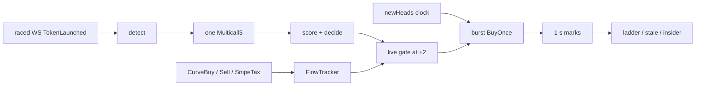

<p align="center">
  
</p>
<p align="center">
  
</p>

<p align="center">
  
  
  
  
  
  
</p>

<p align="center">
  <b>$BODKIN</b> · <code>0xB06B1E58F5ba2a3df1AB74C01cB2A44C5395B3be</code>
</p>

Every pons v2 launch on Robinhood Chain opens behind a **99 % tax that decays 9900 → 618 → 19 → 0 across three Unix seconds**.
Racing the first block hands the buy to the creator. The chain seals a block every 100 ms, orders by arrival, and has no gas
auction, so the only edge left is *when*. Bodkin reads a launch in one Multicall3, scores it with rules you can read, waits for
the first block of second +2, and fires a burst of pre-signed `BuyOnce` txs at the sequencer. Local, open, non-custodial, dry run by default.

| The problem | What bodkin does | Command |
|---|---|---|
| 24 000 launches a day, 559 graduate | one multicall per launch: dev buy, creator tax, who gets the fees, declared bundle, deployer record, launch-farm fingerprint, curve progress, then a 0–100 score with reasons | `hunt` · `board` |
| the first second costs 99 % | clock-scheduled burst at second +2 (19 bps). Helper reverts if the tax is still high or you already bought | `snipe` |
| "who is getting paid on this token?" | reads the fee escrow's own `Credited` / `Claimed` events: recipient, accrued, every claim with a timestamp | `fees` |
| "has this deployer ever graduated anything?" | every launch by the address in the window, with its phase | `dev` |
| following one launch by hand | curve fill, buyers, flow and the opening tax every five seconds, then the pool price | `watch` |
| selling after graduation | routes by phase: curve while trading, Uniswap v4 pool behind the pons hook after, refuses during the swept gap | `sell` |
| your own creator fees | pending balance in the escrow and a one-command claim | `wallet` · `claim` |

---

## Install

Rust (stable, rustc ≥ 1.91). One binary.

```sh
git clone https://github.com/Phosphenq/bodkin && cd bodkin
cp .env.example .env
cargo build --release
./target/release/bodkin doctor
```

On Windows the checkout carries three launchers: `start-hunt.cmd`, `start-snipe.cmd` (dry run) and `start-board.cmd`. Double-click one;
it builds `bodkin.exe` on the first run, copies `.env.example` to `.env` when there is none, and starts that command.

`.env` works on the public RPC. No key is needed for `doctor`, `hunt`, `watch`, `scan`, `fees`, `dev`, `positions`, `outcomes`,
`replay`, or any dry run. `PRIVATE_KEY` is needed only for `--live`, `sell`, `wallet`, `claim` and `helper deploy`.

| | |
|---|---|
| **Required** | rustc ≥ 1.91 (`rustup`) |
| **Runtime** | one `bodkin` binary (alloy + tokio) |
| **For live trades** | `PRIVATE_KEY` and `HELPER_ADDRESS` in `.env`, ETH on Robinhood Chain (bridge at robinhood.com/chain) |
| **Detection** | raced websocket `TokenLaunched` (publicnode by default); `RPC_WS_URL=off` for 300 ms polling; optional `FEED_URL` |
| **Sends** | direct `eth_sendRawTransaction` to `SEQUENCER_URL` (warm HTTP/1.1, IP pin + same-nonce spray). Alloy is not used for send |
| **Public RPCs** | two by default: publicnode for state reads and the official Robinhood RPC for logs. One gate, no JSON-RPC batches. `RPC_URL=` a private provider carries everything |

Co-locate later, not first: [docs/DEPLOY.md](./docs/DEPLOY.md).

## Sixty seconds

```sh
bodkin doctor --probe     # is the chain there, are the pons numbers what we think, does the v4 quoter answer
bodkin hunt               # watch launches arrive with a score and reasons
bodkin board              # the same engine behind a page on 127.0.0.1:4663, dry run
bodkin snipe              # dry run in the terminal: pass reasons, draw, FIRE, marks, exits
bodkin snipe --live       # after you have watched it for an hour
```

---

## Commands

| Command | What it does | Key |
|---|---|---|
| `doctor [--probe]` | RPC, chain id, live pons parameters, optional pool probe | no |
| `hunt` | live feed of launches with a score and reasons; `--json` for pipelines | no |
| `board` | the engine behind a local web page with controls | `--live` only |
| `snipe` | auto-buy launches that pass the rules, manage exits | `--live` only |
| `watch <token>` | follow one token: curve fill, flow, tax, then the pool price | no |
| `scan <token>` | everything on chain about one token | no |
| `fees <token>` | who is paid on a token and every claim | no |
| `dev <address>` | every launch by one deployer with its phase | no |
| `buy <token> <eth>` | buy on the curve or the pool | `--live` only |
| `sell <token> [pct]` | sell a share of your balance wherever the token trades | yes |
| `positions` | open and closed positions with live marks | no |
| `wallet` | the signer: address, balance, unclaimed fees | yes |
| `claim` | claim your creator fees from the escrow | `--live` only |
| `helper` | deploy / check `BodkinBuyOnce` | `--live` to broadcast |
| `outcomes` | summary of `data/outcomes.jsonl` | no |
| `replay` | sampled launches vs an alternate entry second | no |

Every flag and environment variable: [docs/COMMANDS.md](./docs/COMMANDS.md).

## hunt

<p align="center"></p>

One card per launch, a follow-up line at +15 s and +60 s. Every field is a chain read, not an API:

- **dev buy** from the curve's `CurveBuy` events in the launch transaction, as a share of the 1 B supply
- **creator tax** and **fee recipient** from the factory record; `third party` means the fees do not go to the deployer (the builder / KOL deal)
- **exempt wallets**: addresses declared exempt from the opening tax in the launch calldata, which is the declared bundle
- **deployer**: prior launches in ~2 days (~1.73M blocks) and how many graduated, from an index built once at startup
- **fingerprint**: the same dev-buy wei, tax and links from other fresh wallets inside 30 minutes is a launch farm, and scores like one
- **curve**: real quote in / graduation threshold, FDV in the pair asset (ETH, USDG, or a stock token), and the opening tax *right now*

```
bodkin hunt --fire-only              # only FIRE verdicts
bodkin hunt --min-score 70 --json    # JSON lines for your own pipeline
bodkin hunt --no-follow --for 300    # cards only, stop after five minutes
```

## board

<p align="center"></p>

```
bodkin board            # http://127.0.0.1:4663, dry run
bodkin board --live
```

The engine and a page to watch it. **It opens as a feed**: launches arrive, get scored and explained, and nothing fires until you press
**start demo** (dry run) or, with `--live`, **arm live sniping**. Click a launch for the whole read: links to pons, the explorer, Axiom and
FOMO, description, every rule that refused it, every scoring line. **close now** sells a position at the current quote. Five rules have
steppers and change the running engine. A pulse every ten seconds tells a quiet chain from a dead engine. `p` start/stop, `f` fire filter,
`/` search, `esc` close. It binds loopback, it cannot buy on demand, and `--live` is a launch flag, not a button. The rest, and two things
hidden in the page: [docs/BOARD.md](./docs/BOARD.md).

<p align="center"></p>

## snipe

<p align="center"></p>

Detect → one Multicall3 → decide → live flow gate at the +2 boundary → burst `BuyOnce` → 1 s marks for the first minute → ladder / stale / insider, then SL/trail after graduation. Dry run unless `--live`.

```
bodkin snipe                                 # dry run with the defaults from .env
bodkin snipe --eth 0.02 --min-score 70       # bigger shots, stricter score
bodkin snipe --keyword "grok|claude"         # only launches whose name/symbol/description match
bodkin snipe --deployer 0xabc… 0xdef…        # only these deployers
bodkin snipe --allow-pairs                   # also USDG and stock-token pairs
bodkin snipe --live                          # sign and send
```

Every `pass` prints the rule that refused the launch. A launch that declared four wallets exempt from the opening tax is refused by the
defaults even when everything else about it looks good. Relax `maxExemptWallets` on purpose, or not.

On-curve exits: ladder (`EXIT_LADDER`, default 34 % at +100 %, 33 % at +300 %), stale curve, insider sell. After graduation: take profit +80 %, stop loss −35 %, trailing 25 % below the peak, max hold 45 min. Marks are real quotes for the whole position.
Four walls around a live session: a confirmation that prints your address, balance and limits and waits for you to type `arm`; the size
per buy; the position cap; and a **session budget** (`--budget`, 0.05 ETH by default) after which nothing fires, whatever the score.
The rules, the score and where every number comes from: [docs/STRATEGY.md](./docs/STRATEGY.md); what can go wrong: [docs/SAFETY.md](./docs/SAFETY.md).

Symbols and contracts in the terminal are links (Ctrl+click in Windows Terminal, iTerm2, kitty, VS Code): the symbol opens the launch
on Axiom, the contract opens it on FOMO, and every card ends with an `open:` line for pons, Axiom, FOMO and the explorer. Axiom keys a
Robinhood Chain market by the pons curve address and FOMO's page needs a signed-in session; bodkin knows both. The handles in `.env`
(`REF_AXIOM`, `REF_FOMO`) only feed the sign-up links printed under the header; leave them empty to drop those.

## fees

<p align="center"></p>

Who is paid, how much accrued from the curve and from the graduated pool, every claim with a timestamp and transaction.
The screenshot is a graduated token read on 2026-09-03: the recipient is the deployer, 0.2753 ETH came from the curve and 0.1595 ETH from
the pool, one claim of 0.4348 ETH at 18:39 UTC. When the recipient is **not** the deployer, the line says so; that is the builder / KOL deal
in one word.

## watch, scan, dev

```
bodkin watch 0x0da7…45ac   # one line every 5 s: curve bar, flow, taxed buys, price; the pool after graduation
bodkin scan  0x0da7…45ac   # one token: launch, dev buy, exempt wallets, links, fees, deployer, curve activity
bodkin dev   0xbBa6…AD4c   # one deployer: every launch in the window with its phase
```

## buy, sell, positions, wallet, claim

```
bodkin buy  <token> 0.01          # curve before graduation, v4 pool after; dry run
bodkin sell <token> 50 --live     # sell half of your balance wherever the token trades
bodkin positions                  # open and closed, marked live
bodkin wallet                     # address, ETH, unclaimed creator fees
bodkin claim --live               # take the fees out of the escrow
```

---

## How it works



- Detection is a raced websocket subscription to `TokenLaunched`, with a watchdog that walks last-seen → head after 45 s of silence. Optional `FEED_URL` decodes `launchAndBuy` calldata and CREATE2-predicts token/curve. There is no mempool.
- Enrichment is one Multicall3 including the curve's snapshotted tax params. Dev buy from `CurveBuy` in the launch tx; exemptions from calldata (declared length, zeros kept) with `SnipeTaxExempted` as fallback. Missing launch tx is a refuse.
- Sends go to the sequencer over warm HTTP/1.1 (`TCP_NODELAY`, 15 s timeout). Pin the fastest of the three us-east-2 IPs; spray nonce 0 of the burst at the other two. `eth_sendRawTransactionSync` is confirmation-only after a fill. Conditional is a `doctor --probe`, not the fire path.
- Deployer records come from an in-memory index of ~2 days of launches, built on the background lane.
- Curve math is the protocol's integer order. `minTokensOut` is sized as if this buy is last in the entry block.
- Graduation: reserved supply is 28.57 %, but the v4 pool gets **20.41 % + 4.2 ETH**; 8.16 % is permanently locked.

More in [docs/ARCHITECTURE.md](./docs/ARCHITECTURE.md), what can go wrong in [docs/SAFETY.md](./docs/SAFETY.md).

## Numbers behind the defaults (2026-09-03, mainnet)

| | |
|---|---|
| opening tax | `start >> floor(14 · elapsed / window)` on the curve snapshot. Live: 9900 / 618 / 19 / 0 at e=0/1/2/≥3 |
| launch fee | 0.0005 ETH |
| launches / graduations, 24 h | 24 462 / 559 (`TokenLaunched` / `PoolGraduated`, blocks 52 526 287–53 396 287) |
| tempo | 56–152 launches per 3 000 blocks (~5 min) |
| graduation | 4.2 ETH real quote against a 1.68 ETH phantom reserve; pool gets 20.41 % of supply + 4.2 ETH, 8.16 % locked |
| dry-run entries | tax 0.19 %; 1.2–1.6 s after detection over the websocket, which sees the launch block about a second earlier than polling did (polling entries landed 188–203 ms after detection) |
| dry-run entries, 2026-09-04 | two fires, both at tax 0.19 %; the launch card read in 279–284 ms; entry 1.6–2.1 s after detection |
| public RPC | 8 parallel calls pass, 16 → half rejected, a batch of 12 → rejected; 2 calls every 100 ms → zero rejections |

## Tests

```sh
cargo test
```

No network. The curve quote reproduces the 3.00 % dev buy that 0.0535 ETH gives on a fresh curve, the live tax staircase, the score on a
builder-shaped launch and on a serial deployer, the sniper's refusals, the launch-farm fingerprint, session budget, the unreadable-launch
path, the limiter, the deployer index, burst classify, ladder / stale / insider, and v4 ETH-is-currency0.

## FAQ

**Is it safe to run?** The default is a dry run and every command says so. Nothing leaves your machine except JSON-RPC to the endpoint you
configured. Read [docs/SAFETY.md](./docs/SAFETY.md) before `--live`.

**Why did it pass a launch that went 10x?** The `pass` line names the rule. The defaults refuse declared bundles, heavy dev buys, serial deployers,
launch farms and launches without socials; a 10x can come from any of those. Change the rule on purpose, from the board or the flags.

**Why is a fresh entry marked −10 %?** Marks are real sell quotes for the whole position: they include the 1 % fee, the creator tax and price
impact. That is the round trip, not a loss yet.

**Does it front-run?** No. There is no mempool and no priority fee on this chain; bodkin waits for the opening tax to decay and buys at arrival order.

**Can I use my own RPC?** Set `RPC_URL` and, for subscriptions, `RPC_WS_URL`. Raise `RPC_IN_FLIGHT` and lower `RPC_SPACING_MS` on a private endpoint.

## Built on

| Source | What was taken |
|---|---|
| [`ponsdotdev/ponsfamily`](https://github.com/ponsdotdev/ponsfamily) · [docs.ponsfamily.com/v2](https://docs.ponsfamily.com/v2) | contract addresses, ABIs, the curve's fee order, graduation phases |
| [`slightlyuseless/pons-sniper`](https://github.com/slightlyuseless/pons-sniper) (MIT) | the integer-order quote port and the opening-tax cap |
| [`chainstacklabs/robinhood-chain-sequencer-feed`](https://github.com/chainstacklabs/robinhood-chain-sequencer-feed) | the fact that there is nothing to front-run |
| [Uniswap v4 periphery](https://github.com/Uniswap/v4-periphery) · [universal-router](https://github.com/Uniswap/universal-router) | `Actions`, `Commands`, `ExactInputSingleParams`, the Robinhood Chain deployment addresses |
| [Robinhood Chain docs](https://docs.robinhood.com/chain/) | RPC, sequencer model, the palette |

Bodkin is independent of pons, Uniswap and Robinhood. It refers to the network as "Robinhood Chain" and uses none of their marks; the feather
and the pixel cat in the board are its own drawings.

## License

MIT. Keep the dry run on until you have watched it for an hour.
