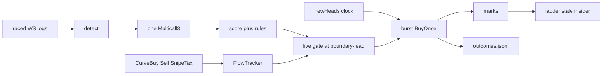

# Architecture

Bodkin is one Rust process with no database service or daemon. An embedded redb file is the authoritative local state; JSON / JSONL files are human-readable exports and observations. Every live mark on screen was read from Robinhood Chain in the last few seconds.

```
Cargo.toml                 workspace
crates/bodkin/src/
  main.rs                  clap: doctor hunt board snipe watch scan fees
                           dev buy sell positions wallet claim helper
                           outcomes capture replay
  chain.rs                 chain 4663, ADDR, RPC and sequencer defaults
  rpc.rs                   lanes hot > enrich > background; BackON retry; latency histogram
  pons/{curve,tax,clock,launches,enrich,stream,fingerprint,deployer}.rs
  score.rs
  engine.rs                decide, live gate, pick_exit
  run.rs                   deadline/priority snipe loop: burst fire, marks, outcomes
  trade/{scheduler,submitter,burst,wallet,exec,journal,state,curve,pool,v4,positions}.rs
  research.rs              bounded capture, verified manifests, persistent risk ledger
  board.rs                 axum 127.0.0.1 + SSE
  outcomes.rs / replay.rs  typed provenance envelopes; deterministic and research replay
data/bodkin.redb           ACID positions + operation journal; exclusive process lock
data/positions.json        atomic export; imported only when redb has no snapshot
contracts/                 Foundry: BodkinBuyOnce.sol
web/board.html             board UI
```

`trade/state.rs` opens `data/bodkin.redb` in redb's single-process mode. Immediate-durability transactions commit operation intents before submission and position changes before they are reported. A valid legacy `positions.json` or `transactions.json` is imported once when the corresponding redb table is empty; after that, redb wins and JSON is export-only.

## Data flow of one launch



## Why these choices

- **Subscription first, polling second.** Robinhood Chain has no public mempool. Raced websocket logs use an LRU identity set and process `removed` notifications; the watchdog walks a contiguous last-scanned → head range after silence. Entry enrichment revalidates the launch transaction before anything can fire.
- **No sequencer-feed shortcut.** The prior stub trusted a claimed signer field instead of cryptographically verifying `signatureV2`, so it was unreachable and has been removed. Detection remains receipt/log-backed websocket plus watchdog polling.
- **Two public endpoints, one gate, no JSON-RPC batches.** Official RPC 429s bursts and meters `eth_getLogs`; publicnode refuses logs.
  Lanes (hot / enrich / background), spacing, cooldown, per-endpoint bench. BackON supplies bounded jittered retry timing and `Retry-After`; endpoint capabilities and hot-lane reservations remain Bodkin-specific. Deadline cancellation cannot leave a future pacing reservation, permits remain held through response-body consumption, and HDR percentiles expose total call latency. Fifteen curve/token/factory reads go through Multicall3.
- **Ordered flow with rollback.** FlowTracker stores canonical event identities in block/transaction/log order. Duplicates replace rather than increment, removed logs reverse their effects, and a changed block-hash anchor rewinds and rebuilds from the launch block. Curve positions refresh that cursor before evaluating exits.
- **Canonical execution.** A mined receipt must contain the requested transaction hash, status, block number/hash, logs, gas used, and effective gas price; its block hash must match `eth_getBlockByNumber`. Applied operations are rechecked for 64 blocks at startup and every ten seconds while live. Any changed receipt halts execution.
- **Embedded transactional state, readable exports.** redb provides immediate-durability ACID commits, crash recovery, integrity checks, and exclusive process locking for positions and transaction operations. `atomic-write-file` refreshes JSON exports without making them authoritative.
- **Commodity parsing stays in crates.** dotenvy parses `.env` without mutating process globals; Alloy parses ETH units; strip-ansi-escapes plus unicode-segmentation/unicode-width own terminal text boundaries. LRU owns bounded launch deduplication, HDR Histogram owns latency distributions, and Alloy enables only consensus, EIP encoding, signing, RPC types and ABI support—not `full` or its provider stack. Jsonrpsee owns the two bounded websocket subscriptions.
- **Replay is causal.** Schema-2 observations carry run, sequence, chain, and version provenance. Enrichment pins Multicall3 to a canonical EIP-1898 block hash and records that block/timestamp; replay applies only later ordered buy/sell/fee/tax events strictly before the candidate entry second. Missing provenance remains unmeasured, and each experiment prints a dataset hash plus strategy manifest.
- **Sequencer is write-only.** `https://sequencer.mainnet.chain.robinhood.com` accepts `eth_sendRawTransaction` (and Sync / Conditional).
  It **blocks until the block is built** (~100 ms). Client timeout > 12 s (`queue-timeout`). Each resolved IP keeps one persistent warm Reqwest client; the first nonce is sprayed across them and later attempts reuse those pools.
- **No recommended fillers on the hot path.** Nonce, gas, max fee (3× cached base), priority 0, type-2, chain 4663 are local.
  `PrivateKeySigner::sign_transaction_sync`. Alloy is not used for send.
- **BuyOnce helper.** Reverts unless `currentSnipeTaxBps(recipient) ≤ maxTaxBps` and `balanceOf(recipient) == 0`. Early helper reverts
  pay gas (Nitro `max-revert-gas-reject` default 0). That is why the clock lead is tight.
- **Conditional is a probe.** Default TxPreChecker compares to the last *sealed* header. `timestampMin = launchedAt+2` is late by one
  ~100 ms block. Reject-not-wait. `blockNumberMin/Max` are L1 numbers. `doctor --probe` must show immediate `-32003` before anyone parks on it.
- **Deployer history from memory.** ~1.73M blocks (~2 days) on the background lane. Do not call the ponsfamily HTTP API (v1-only).
  Launches and graduations must complete over one common canonical range before admission. A versioned checkpoint is anchor-verified and catches up only its missing suffix; a partial/error scan stays loading/failed. Startup work is serialized on a single-permit limiter so it yields RPC capacity to deadline-bound launch enrichment.
- **One priority execution owner.** Emergency manual/insider/research-risk exits outrank unsubmitted deadline entries. Deadline entries outrank fresh routine exits, but routine work becomes eligible after 100 ms. Ownership remains held through receipt reconciliation and durable application; a missed entry cutoff is skipped rather than sent late.
- **Research is physically separate.** Capture constructs no wallet or submitter and writes a new, capped directory with a sequence/hash manifest. A research board requires a state path outside normal `data/`; its profile/run and modeled ledger survive restart, and unknown valuation or a 10% drawdown latch blocks further admissions. These numbers are modeled evidence, not live-profit claims.
- **Graduation pool split.** 20.41 % of supply + 4.2 ETH in the v4 pool; 8.16 % locked. Do not quote the pool as 28.57 %.
