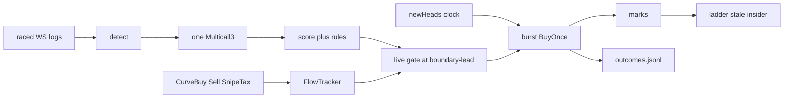

# Architecture

Bodkin is one Rust process. No database, no service, no daemon: `data/` holds JSON / JSONL, and every number on screen was read from
Robinhood Chain in the last few seconds.

```
Cargo.toml                 workspace
crates/bodkin/src/
  main.rs                  clap: doctor hunt board snipe watch scan fees
                           dev buy sell positions wallet claim helper
                           outcomes replay
  chain.rs                 chain 4663, ADDR, sequencer / feed defaults
  rpc.rs                   lanes hot > enrich > background; race(); 429 bench
  pons/{curve,tax,clock,launches,enrich,stream,fingerprint,deployer,feed}.rs
  score.rs
  engine.rs                decide, live gate, pick_exit
  run.rs                   snipe loop: burst fire, 1 s marks, outcomes
  trade/{submitter,burst,wallet,curve,pool,v4,positions}.rs
  board.rs                 axum 127.0.0.1 + SSE
  outcomes.rs / replay.rs
contracts/                 Foundry: BodkinBuyOnce.sol
web/board.html             board UI
```

## Data flow of one launch



## Why these choices

- **Subscription first, polling second.** Robinhood Chain has no public mempool. The earliest anyone can see a launch is the block it
  landed in. Raced websockets (publicnode + whatever you add) plus a watchdog that walks last-seen → head after 45 s of silence.
- **Optional sequencer feed.** `FEED_URL` with header `Arbitrum-Requested-Sequence-Number` (empty header = ~124 s / 1203-msg backlog).
  Verify `signatureV2` signer `0xDaa526086787d9DEbE1D7F3FFdb1fE50cf8687F4`. Useful to pre-sign; from Europe it does not beat publicnode `newHeads`.
- **Two public endpoints, one gate, no JSON-RPC batches.** Official RPC 429s bursts and meters `eth_getLogs`; publicnode refuses logs.
  Lanes (hot / enrich / background), spacing, cooldown, per-endpoint bench. Fifteen curve/token/factory reads go through Multicall3.
- **Sequencer is write-only.** `https://sequencer.mainnet.chain.robinhood.com` accepts `eth_sendRawTransaction` (and Sync / Conditional).
  It **blocks until the block is built** (~100 ms). Client timeout > 12 s (`queue-timeout`). Parallel conns or a burst is eight serial blocks.
- **No recommended fillers on the hot path.** Nonce, gas, max fee (3× cached base), priority 0, type-2, chain 4663 are local.
  `PrivateKeySigner::sign_transaction_sync`. Alloy is not used for send.
- **BuyOnce helper.** Reverts unless `currentSnipeTaxBps(recipient) ≤ maxTaxBps` and `balanceOf(recipient) == 0`. Early helper reverts
  pay gas (Nitro `max-revert-gas-reject` default 0). That is why the clock lead is tight.
- **Conditional is a probe.** Default TxPreChecker compares to the last *sealed* header. `timestampMin = launchedAt+2` is late by one
  ~100 ms block. Reject-not-wait. `blockNumberMin/Max` are L1 numbers. `doctor --probe` must show immediate `-32003` before anyone parks on it.
- **Deployer history from memory.** ~1.73M blocks (~2 days) on the background lane. Do not call the ponsfamily HTTP API (v1-only).
- **Graduation pool split.** 20.41 % of supply + 4.2 ETH in the v4 pool; 8.16 % locked. Do not quote the pool as 28.57 %.
